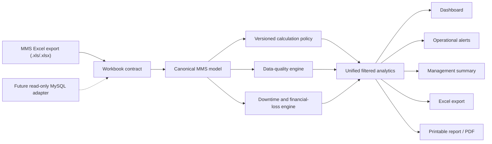

# Architecture

## System context

## Runtime layers

| Layer | Main files | Responsibility |
|---|---|---|
| Import contract | `app/mms-workbook-contract.ts` | Validates format, sheets, aliases, columns and limits |
| Canonical model | `app/mms.ts` | Preserves production intervals, downtime events and source evidence |
| Data sources | `app/mms-data-source.ts`, `db/mms-readonly-data-source.ts` | Provides Excel and read-only database boundaries |
| Calculation policy | `app/calculation-policy.ts` | Selects the only formulas allowed for production use |
| Calculation engines | `app/*-engine.ts` | Production, Availability, Performance, Quality, downtime and data quality |
| Analytics | `app/analytics-query-engine.ts` | Applies one filter scope and recalculates every result |
| Alerts | `app/operational-alert-engine.ts` | Creates, deduplicates, acknowledges and resolves evidence-backed alerts |
| Summaries | `app/management-summary-engine.ts`, `app/ai-management-summary-provider.ts` | Produces deterministic or validated AI wording from verified metrics |
| UI | `app/page.tsx`, `app/dashboard-ui.tsx`, `app/globals.css` | Dashboard navigation, filters, themes and personalized layout |
| Reports | `app/report-export.ts`, `app/printable-report.tsx` | Generates Excel worksheets and browser-printable A4 output |
| Reliability | `app/synchronization-engine.ts`, `app/security.ts` | Handles refresh state, deduplication, retries, sanitation and redaction |

## Important boundaries

### Policy authority

`app/calculation-policy.ts` is authoritative. Historical lower-level engines
and diagnostic scripts remain for regression and comparison. They must not be
called directly to bypass the active policy in production.

### Read-only data access

The database abstraction exposes `select` only. It has no insert, update,
delete, migration or raw-SQL method. Excel remains the supported production
input until 3D supplies a MySQL schema and a dedicated read-only account.

### Unified analytics

Dashboards, alerts, management evidence and exports consume the same
`FilteredMmsAnalytics` result. This prevents different screens from applying
different formulas or record selections.

### Client/server behavior

Excel parsing and report generation are client-side. The optional management
summary API is server-side and receives bounded structured metrics—not raw
workbook rows. Without an API key, the deterministic summary is used.

## Technology

- Next.js 16 App Router
- React 19
- TypeScript 5.9
- Tailwind CSS 4 plus a custom CSS design system
- SheetJS `xlsx`
- Vinext/Vite/Cloudflare-compatible build
- Optional Drizzle boundary for Cloudflare D1 support
- Future MySQL adapter through the read-only data-source interface
